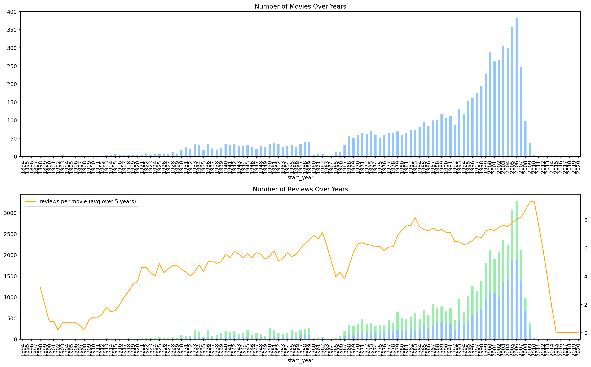
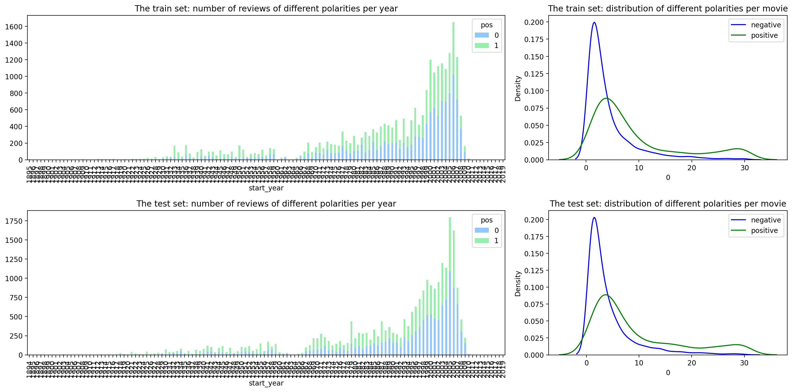
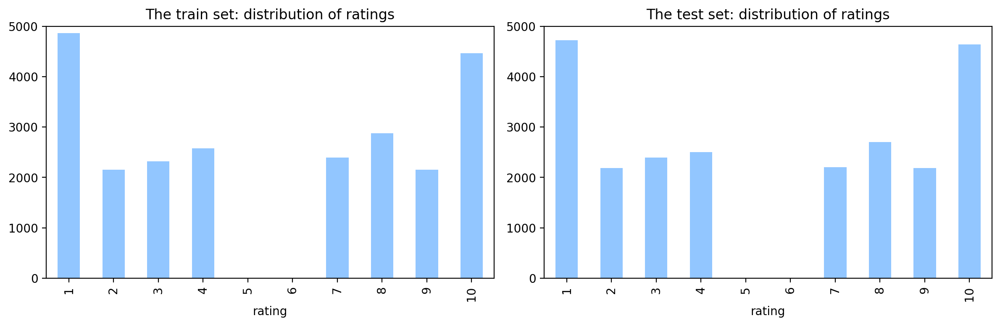
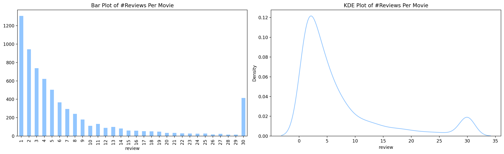
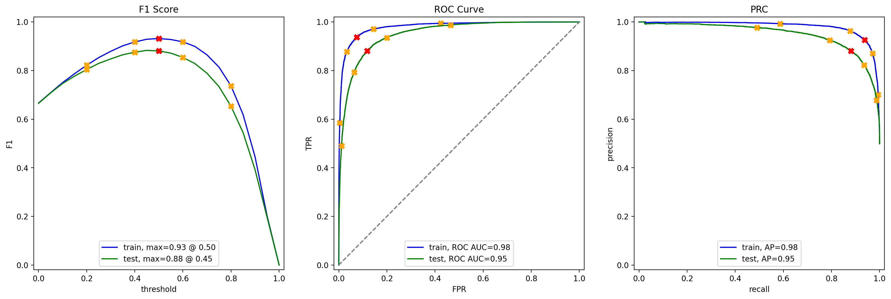

# TripleTen Sprint 14 - ML for Text

### What we learned throughout the sprint:

- Preprocess textual data;
- Create a bag-of-words for a corpus;
- Calculate TF-IDF;
- Use BERT to convert textual data into embeddings;
- Use texts to train ML models.

### Project - Movie Review Sentiment Detection

An online film community is developing a system for filtering and categorizing movie reviews. 

#### Task

Build a machine learning model to automatically detect positive/negative sentiments of text from IMDB movie reviews with polarity analysis and reach an F1 score above a target threshold of 0.85.

#### The Data

The data is spread across one file with three main selected features:

- `review`: the review text
- `pos`: the target, '0' for negative and '1' for positive
- `ds_part`: 'train'/'test' for the train/test part of the dataset

*The data was provided by Andrew L. Maas, Raymond E. Daly, Peter T. Pham, Dan Huang, Andrew Y. Ng, and Christopher Potts. (2011). Learning Word Vectors for Sentiment Analysis. The 49th Annual Meeting of the Association for Computational Linguistics (ACL 2011).*

#### The Process

We first performed exploratory data analysis to make conclusions on class imbalance and preprocess the data for modeling.

As we headed into the modeling portion, we trained at least three different models with the given train dataset. Testing the model for the given test dataset. 

To better understand some of our models, we introduce a new set of reviews, classify them and evaluate the probabilities while comparing to the previous modeling results.

#### Results

Through the use of tokenization and lemmatization via NLTK and spaCy, our achieved F1 scores throughout the 3 models is above our target value of `0.85`. The model with the highest F1 score was our LinearRegression model that used both NLTK and spaCy processing for the tokenization/lemmatization of our review corpus. Scores were as follows:

    - `LR + NLTK`: **0.88**

    - `LR + spaCy`: **0.88**

    - `LGBM + spaCy`: **0.86**
    

*We were able to achieve all of these scores without the need to tune or search for the optimial hyperparameters.*

# Chart Examples

Included is the full Notebook which breaks out the description of our results.

# Plans for updates

Update graphs and compute results via the BERT model which was skipped over due to computational requirements.
