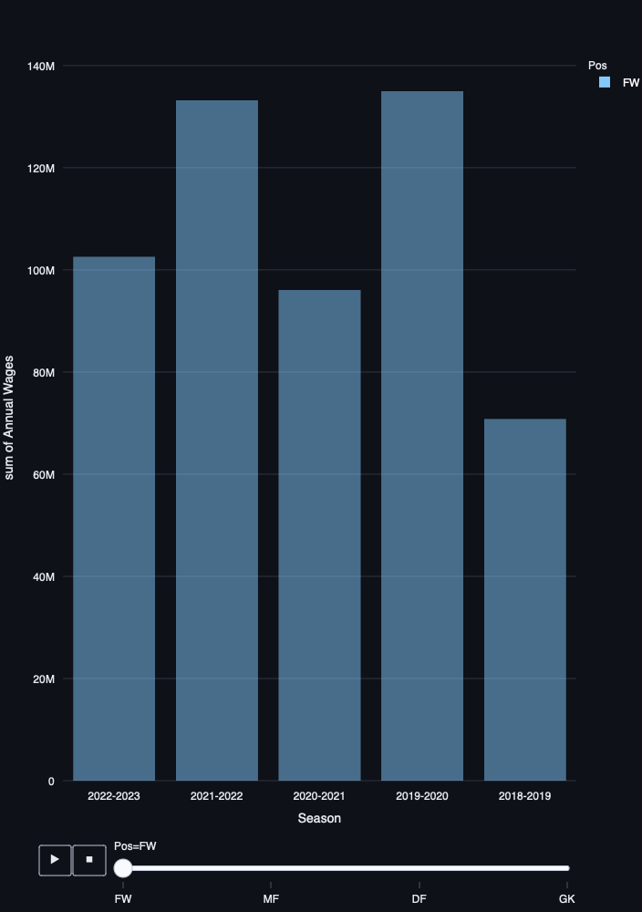
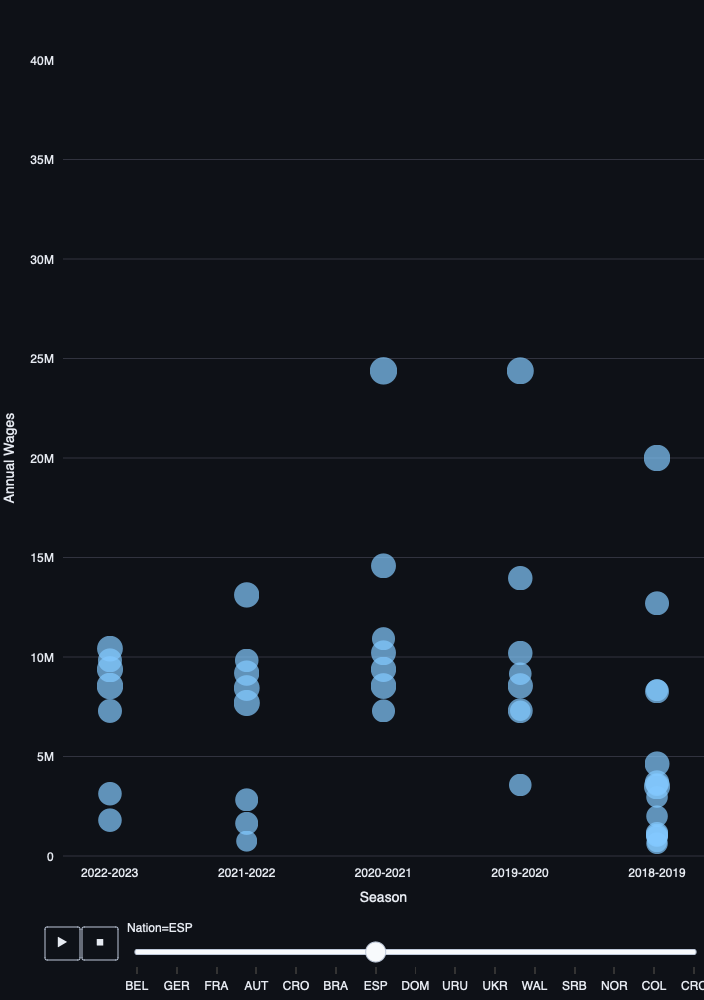

# TripleTen Sprint 4 - Software Development Tools

### What we learned throughout the sprint:

- Maneuver around development environment, Git and Github.
- Learn new, intermediate Python techniques.
- How to utilize streamlit and configure files.
- Work with the Render platform.

### Project - Utilizing Render

This project contains Real Madrid (football club) wage information by player for the last 5 seasons. Users are able to filter the dataframe by each column and/or parameters included in said columns. The project also includes 3 charts, two histograms and one scatterplot which visualize wage/season information.

If someone wants to run this on their local machine, simply clone the repository, head to your terminal, navigate to the directory and run the 'streamlit run app.py' command.

#### Task

Develop and deploy a web application to a cloud service so that it is accessible to the public. Leverage the Render platform.

#### The Data

The data is contained in one file:

- `player`: player name
- `pos`: position
- `age`
- `nation`: player nationality
- `weekly_wages`
- `annual_wages`
- `season`: football season year

#### The Process

This project is broken out into a few parts:

1) GitHub account creation

2) Data download

3) Exploratory Data Analysis

4) Web application dashboard creation

5) Application deployment to Render

#### Results

We successfully deployed the application to Render: https://sprint-4-project-bh9h.onrender.com

# Chart Examples

Total Annual Wages by Position (£)

Annual Wage Distribution by Nation (£)

Included is the full Notebook which breaks out the description of our results.

# Plans for updates

Nothing at the moment.
