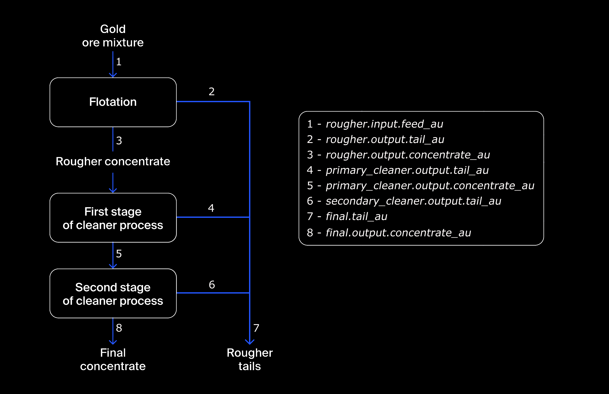
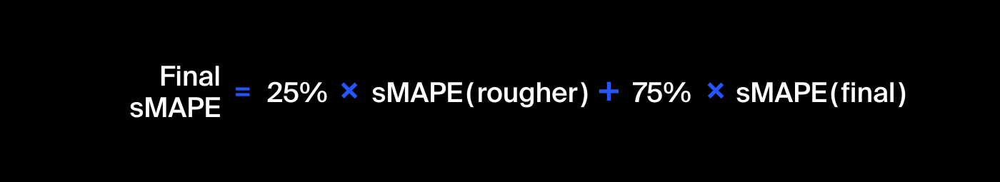
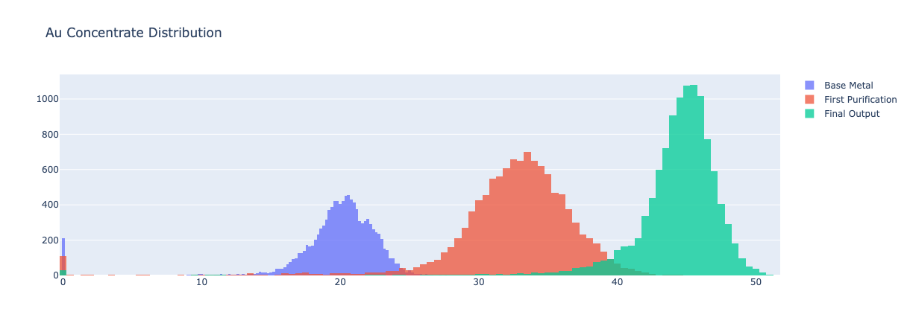
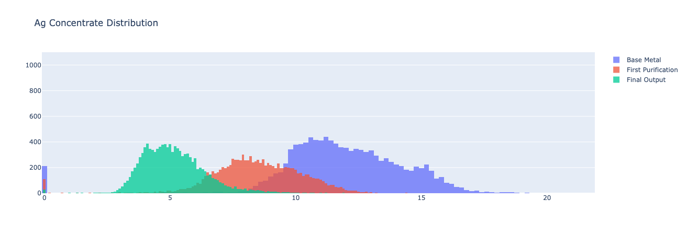
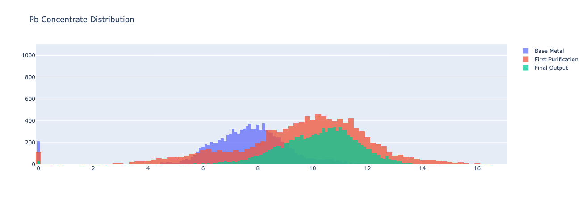
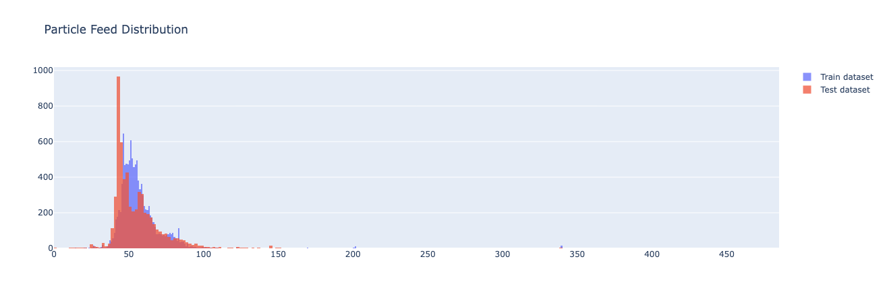
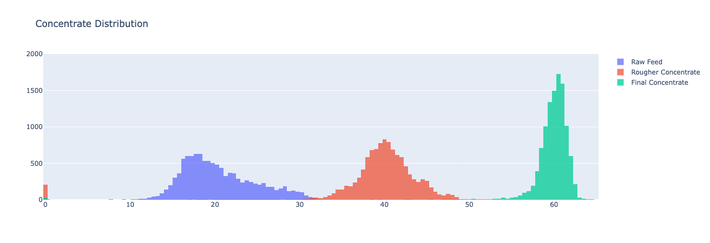

# TripleTen Sprint 10 - [Integrated Project 2](TripleTen Projects/Sprint 10 - Integrated Project 2/Integrated Project 2 v2.ipynb)

### What we learned throughout the sprint:

- Studied supervised learning, and know how to develop models and evaluate their quality. 
- Became familiar with machine learning and A/B testing. 

### Brief

A company who develops efficiency solutions for the mining industry would like to predict the amount of gold recovered from ore while eliminating unprofitable parameters.

#### Task

Prepare a machine learning model for the company wwhich predicts the amount of gold recovered from ore. Leveraging data on extraction and purification.

#### The Data

The data is spread across three files:

- Data is indexed with the date and time of acquisition (`date` feature). 
- Parameters that are next to each other in terms of time are often similar.

**Technological process data**
- `Rougher feed`: raw material
- `Rougher additions (or reagent additions)`: flotation reagents: *Xanthate*, *Sulphate*, *Depressant*
    `Xanthate`: promoter or flotation activator
    `Sulphate`: sodium sulphide for this particular process
    `Depressant`: sodium silicate
- `Rougher process`: flotation
- `Rougher tails`: product residues
- `Float banks`: flotation unit
- `Cleaner process`: purification
- `Rougher Au`: rougher gold concentrate
- `Final Au`: final gold concentrate

**Parameters of stages data**
- `air amount`: volume of air
- `fluid levels`
- `feed size`: feed particle size
- `feed rate`

#### The Process

We study the technological process of gold extration from ore and its various stages and leverage a formula to simulate the gold recovery process. 

Our data is examined for any possible quality issues and we take into the differences in the number of features across the *Train*, *Test* and *Full* data and a missing target feature from our *Test* dataset. Concentration of metals is cross-compared at different stages.

We then calculate the symmetric Mean Absolute Percentage Error (sMAPE) as our evaluation metric in order to predict two values:
    1. rougher concentrate recovery `rougher.output.recovery`
    2. final concentrate recovery `final.output.recovery`

Multiple models are built and evaluated using cross-validation, picking the best model and evaluating it using the *Test* sample. 

#### Results

We first hone in on the best model option based on model scores (RandomForest Regressor) then further analyze the model through the RMSE metric to see how it handles newly introduced data, utilizing the RMSE of a dummy regressor model as benchmark for comparison.

Based on the final sMAPE comparison between the RandomForestRegressor and the DummyRegressor model, we conclude that the RandomForestRegressor gives us a % error of ~25% when leveraging the test dataset (*compared to a nearly identical result from our DummyRegressor model*). And, when going one step further and analyzing the final sMAPE value on our train dataset, we find a ~7% error. Meaning our final sMAPE result on our test dataset introduces an +18% delta to our overall results/predictions. 

# Chart Examples

Included is the full Notebook which breaks out the description of our results.

# Plans for updates

Nothing at the moment.
