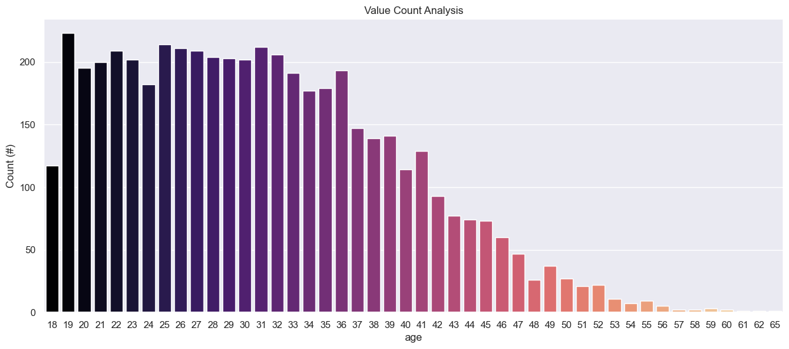
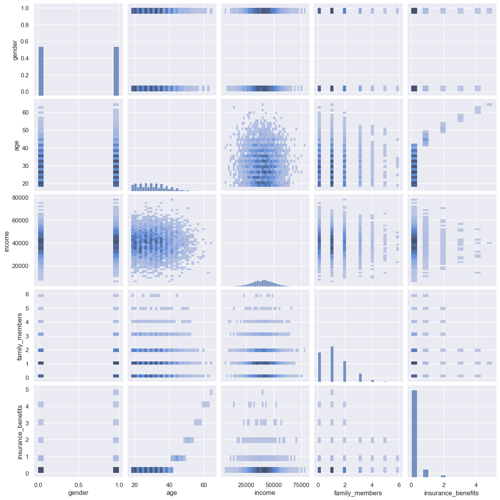
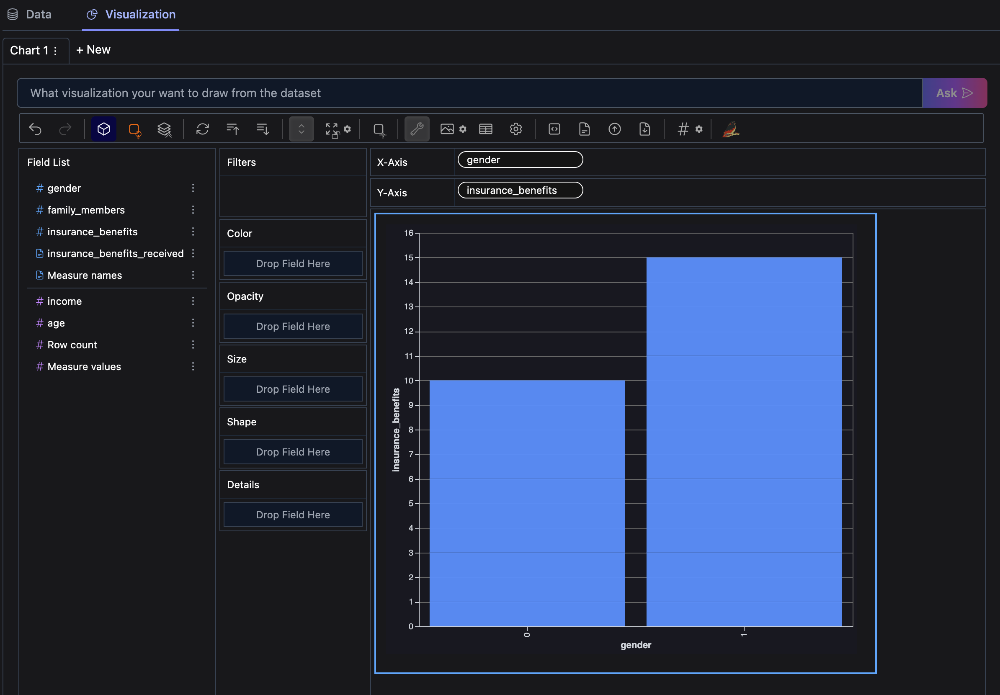

# TripleTen Sprint 11 - [Linear Algebra](TripleTen Projects/Sprint 11 - Linear Algebra/Linear Algebra.ipynb)

### What we learned throughout the sprint:

- Perform operations with matrices and vectors.
- Create machine learning classes.
- Explain how linear regression works.

### Brief

An insurance company wants to solve several tasks with the help of machine learning, evaluate the possibility of doing so.

#### Task

The tasks are broken out into four parts:
`Task 1`: Find customers who are similar to a given customer in order to help the company's agents with marketing.
    **Process**
    - We develop a procedure that returns k nearest neighbors (objects) for a given object based on the distance between the objects. Utilizing both the Euclidean and Manhattan Distance metrics.
    - Then we further analyse the impact of scaling for the KNN algorightm and compare the distance results.
`Task 2`: Predict whether a new customer is likely to receive an insurance benefit.
    **Process**
    - A KNN-based classifier is built and its quality is measured via the F1 metric for both scaled and non-scaled data.
    - A dummy model is built as a benchmark and to validate that our KNN-based classifier is working as it should.
`Task 3`: Predict the number of insurance benefits a new customer is likely to receive using a linear regression model.
    **Process**
    - RMSE metric evaluation is performed for a Linear Regression model.
`Task 4`: Protect clients' personal data without breaking the model from the previous task.
    **Process**
    - Data obfuscating is deployed by leveraging documentation on Matrices and Matrix Operations as well as NumPy.

#### The Data

The data is housed in one file:

`Features`: insured person's gender, age, salary, and number of family members
`Target`: number of insurance benefits received by an insured person over the last five years

*Necessary to develop a data transformation algorithm that would make it hard to recover personal information if the data fell into the wrong hands through data masking, or data obfuscation. The data should be protected in such a way that the quality of machine learning models doesn't suffer.*

#### The Process

Exploratory data analysis is performed to check that the data is free of issues - including but not limited to missing data, data type misaligment or extreme values 

We then work on each of our four tasks to answer the questions and draw conclusions based on our experience working on the project. This includes creating visualizations that helped us analyze distributions and/or any possible correlations.

#### Results

We conclude that scaling and imbalancing play a large role in the quality of our metrics or models after comparing the results to the output from normalizing/standardizing across dataset's features.

Then, we prove that obsfucating our data can work with Linear Regression models without affecting our RMSE metrics.

# Chart Examples

Included is the full Notebook which breaks out the description of our results.

# Plans for updates

None at the moment.
