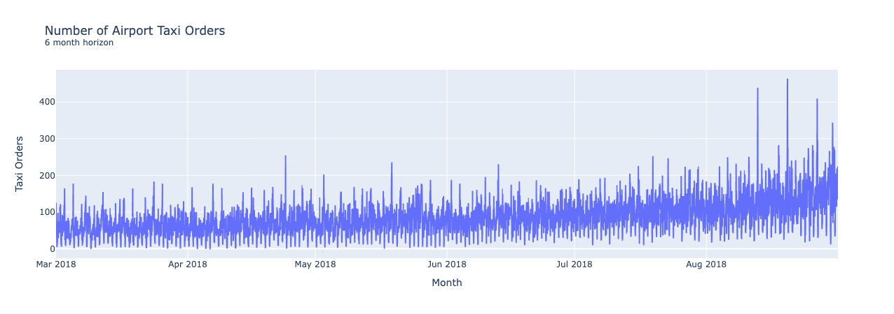
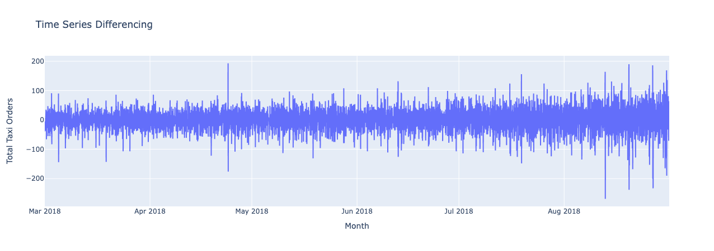
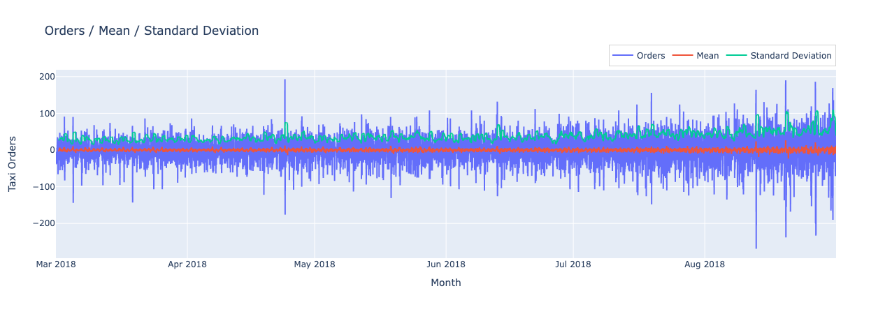
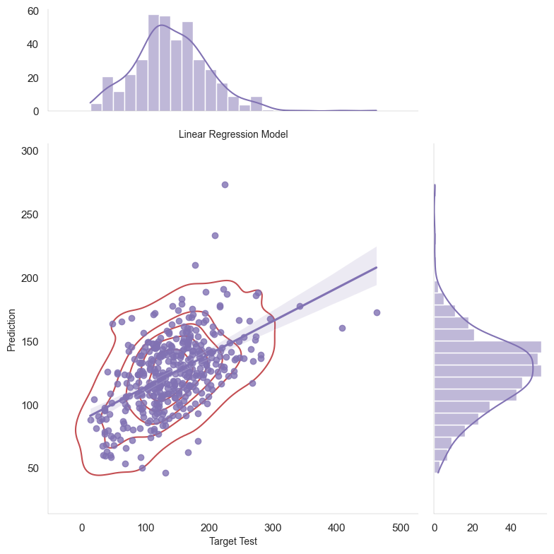

# TripleTen Sprint 13 - [Time Series](TripleTen Projects/Sprint 13 - Time Series/time-series.ipynb)

### What we learned throughout the sprint:

- Analyze time series and find the trends and seasonality.
- Create features for time series.
- Train models using time series.

### Brief

A taxi company would like to attract more drivers during peak hours leveraging historical data on taxi orders at airports. 

#### Task

Build a model to predict the amount of taxi orders for the next hour. Targeting an RMSE metric of no more than 48 on our test dataset.

#### The Data

The data is contained in one file with two features:

- `datetime`: our DF index, time feature
- `num_orders`: number of orders, target feature

#### The Process

Performed exploratory data analysis to make conclusions on any perceived issues, resampled the data by one hour and futher preprocessed the data for modeling.

Further utilizing our `datetime` feature, we break out charts to take a look at seasonality, trends and residuals to get a wider understanding of our dataframe.

We then train various models with different hyperparameters in order to find our most optimal result. Our test dataset used for evaluation was manipulated to be 10% of the initial set.

#### Results

After training various models and tuning their hyperparameters we found the gradient boosting techniques gave us better RMSE results in comparison to the regression models initially deployed. We selected the LightGBM model as our ideal and recommended model due to the overall advantages of LGBM parameter tuning and the flexibility from introducing more features/pattern complexity (e.g. new features we advised that would be helpful, a broader time horizon.)

Our achieved RMSE value was that of ~44. This was partially achieved by tuning the `max_lag` and `rolling_mean` parameters crafted from feature creation. These parameters seem to have played a significant role (compared to some of the hyperparameters) in getting the RMSE near the target value.

# Chart Examples

Included is the full Notebook which breaks out the description of our results.

# Plans for updates

Nothing at the moment.
