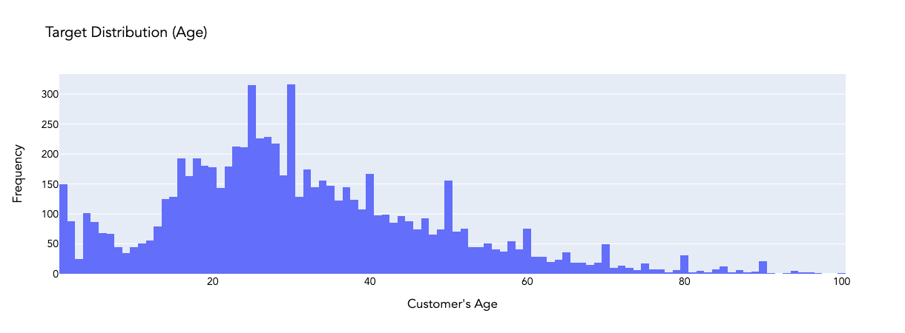
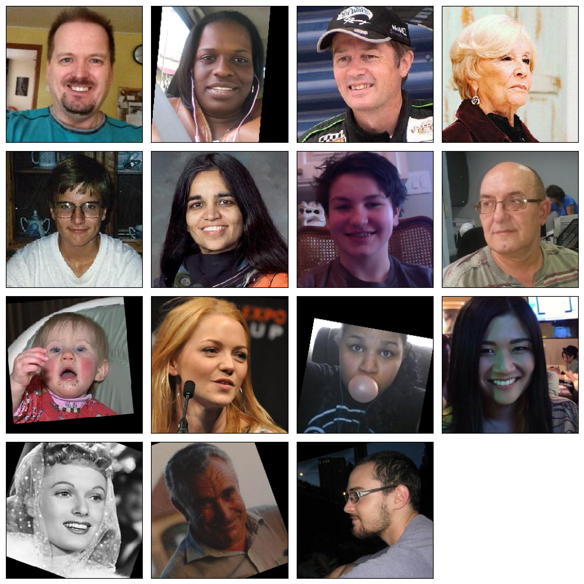

# TripleTen Sprint 15 - [Computer Vision](TripleTen Projects/Sprint 15 - Computer Vision/Computer Vision.ipynb)

### What we learned throughout the sprint:

- Use the Keras tools to train neural networks.
- Build fully connected and convolutional networks.
- Work with ResNet.

### Brief

A supermarket chain would like to explore the introduction of a computer vision system to help them adhere to alcohol laws. 

#### Task

Develop and train a convolutional neural network model on a GPU platform, using thousands of photos of people to predict the approximate age of customers. Obtain a MAE score under 8. 

#### The Data

The data is spread across two files:

The `final_files` folder with 7.6k photos

The `labels.csv` file with labels, with two columns: `file_name` and `real_age`

*Given the fact that the number of image files is rather high, it is advisable to avoid reading them all at once, which would greatly consume computational resources.*

#### The Process

First, we perform the exploratory data analysis looking at the dataset size, exploring the age distribution and displaying a number of photos for different ages to get an overall impression.

We then head over to model training and evaluation, building a convolutional neural network tailored for a GPU platform which contains four major functions to load the train/test datasets, define the model and train the model. Our final step is analyzing the result of model training and crafting conclusions.

#### Results

After leveraging the ResNet50 architecture to analyze customer images and choosing optimal parameters, we are able to get to the target MAE of less than 8. 
    - With that said, given the heightened risk and sensitivity of selling alcohol to people under the legal age along with the significant fines and problems that come with that, it would be **highly advisable** to incorporate another layer of verification at the very least if this is to be deployed (along with more in-depth tuning/optimization). There is a reason afterall that we don't see this type of system reliance at Whole Foods or other, much larger 'supermarkets'.

The supermarket chain should be able to leverage our computer vision model to also:

    1) categorize fruits and vegetables that are usually weighted and looked up by consumers,
    
    2) keep track of / monitor items that might not have been scanned (either categorized as losses or theft, up to the business on how to pivot),
    
    3) potentially track facial movement to predict emotions / emotional state and comparing that data to checkout carts (could open up a new path to advertise food pairings to individual and recurring shoppers) <-- would be extra interesting comparing this information to the time of day / month / year and weather to paint a truly personalized picture per shopper.

# Chart Examples

Included is the full Notebook which breaks out the description of our results.

# Plans for updates

None at the moment.
