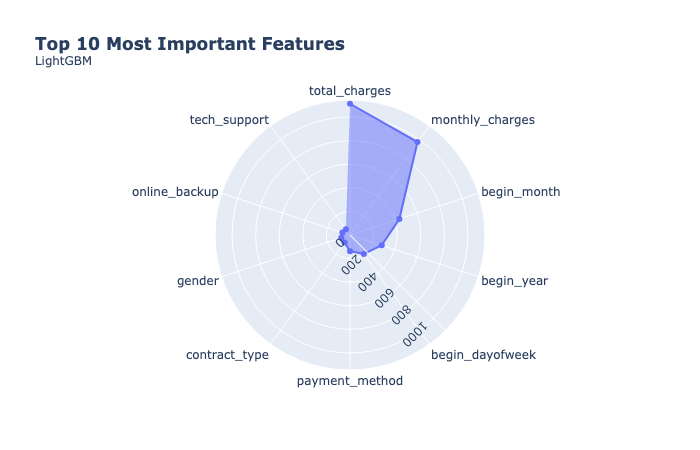
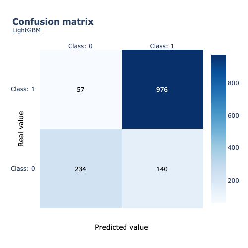

# TripleTen Sprint 17 - Final Project

This is the final project I worked on in the TripleTen Data Science program. This project was broken out into three sections: **Part 1** - Creating a Project Plan, **Part 2** - Developing the solution code and **Part 3** - Finalizing the project with a solution report. It integrated a ton of material we've learned throughout the program, was a decent amount of fun.

### Brief

A telecom operator wants to forecast customers who might be planning on leaving its service. Those in danger of churning will be offered promotional codes and special plans.

#### Task

The goal of the project was to synthesize all the information provided by the client, a telecomm operater named Interconnect, in order to provide insights into who are the most likely customers in danger of leaving the service and to futher strategize what to provide to said customers in order to retain them.

#### The Data

The data is spread across four files:

- `contract.csv`: contract information
    - `'customer_id'`: unique ID assigned to each customer
    - `'begin_date'`: sign-up date for each customer
    - `'end_date'`: our target feature, **No** == customer remains with the service
    - `'contract_type'`: plan type
    - `'paperless_billing'`: way of receiving billing statements
    - `'payment_method'`: method of payment
    - `'monthly_charges'`: monthly charges for the services provided
    - `'total_charges'`: total charges for the services provided
- `personal.csv`: the customer's personal data
    - `'customer_id'`: unique ID assigned to each customer
    - `'gender'`: gender of the customer
    - `'senior_citizen'`: age identifier for each customer
    - `'partner'`: customer husband/wife or partner
    - `'dependents'`: customer dependents
- `internet.csv`: information about internet services
    - `'customer_id'`: unique ID assigned to each customer
    - `'internet_service'`: type of internet service
    - `'online_security'`: additional internet service
    - `'online_backup'`: additional internet service
    - `'device_protection'`: additional internet service
    - `'tech_support'`: additional internet service
- `phone.csv`: information about telephone services
    - `'customer_id'`: unique ID assigned to each customer
    - `'multiple_lines'`: quantity of cell phone lines

Each file contains the primary key `customer_id` which is leveraged in order to do the data merging. Our primary metric is **AUC-ROC**.

#### The Process

We first explored the dataset to create a project plan and pre-emtively idenfity areas of concern while documenting additional, clarifying questions to the client in order to have a better grasp at the scope of the ask. 

Once our team leader approved our project plan we dove into data preprocessing and further EDA via data visualizations. Here we fixed the feature naming conventions, replaced or filled in any missing values and perfomed encoding in order to prepare our features as proper model inputs. 

We merged our data, analyzed our target class frequency for imbalancing and created a set of new features from our `begin_date` values. Our final processing step before heading into modeling was to scale our numerical data for uniformity.  

Seven models were then developed and cross-compared in order to find our optimal metric value. These we all benchmarked against a dummy model. 

#### Results

The solution report tackled 4 important questions related to the plan, difficulties encountered, key steps in the process and the final model's score quality. Our final scoring metric was an **AUC-ROC** above 90%.

# Chart Examples

Included is the full Notebook which breaks out the description of our results.

# Plans for updates

None at the moment.
