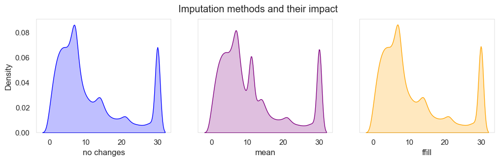
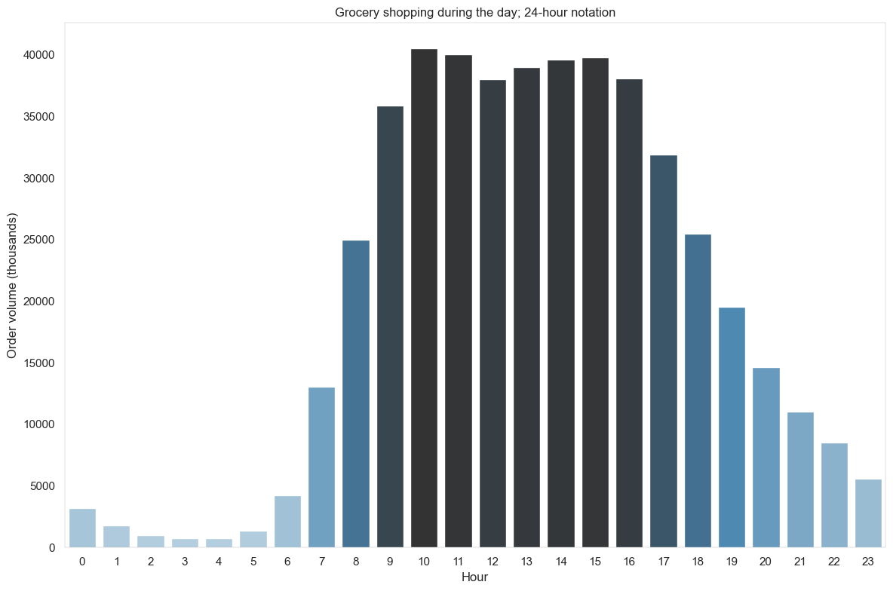

# TripleTen Sprint 2 - Exploratory Data Analysis

### What we learned throughout the sprint:

- How to read data from different sources and formats and how to address missing or duplicate values.
- Making clear and effective figures from your data and analytical results.
- Filtering and grouping data for more advanced aggregate analysis and engineering new columns by processing existing columns.
- Combining data via merging and concatenation.

### Brief

A grocery delivery platform wants further insight into the shopping habits of its customers.

#### Task

Clean-up the data, prepare an insight report an create plots to communicate your results.

#### The Data

The data is spread across five files:

`instacart_orders.csv`: each row corresponds to one order on the Instacart app
- `order_id`: ID number that uniquely identifies each order
- `user_id`: ID number that uniquely identifies each customer account
- `order_number`: the number of times this customer has placed an order
- `order_dow`: day of the week that the order placed (which day is 0 is uncertain)
- `order_hour_of_day`: hour of the day that the order was placed
- `days_since_prior_order`: number of days since this customer placed their previous order
`products.csv`: each row corresponds to a unique product that customers can buy
- `product_id`: ID number that uniquely identifies each product
- `product_name`: name of the product
- `aisle_id`: ID number that uniquely identifies each grocery aisle category
- `department_id`: ID number that uniquely identifies each grocery department category
`order_products.csv`: each row corresponds to one item placed in an order
- `order_id`: ID number that uniquely identifies each order
- `product_id`: ID number that uniquely identifies each product
- `add_to_cart_order`: the sequential order in which each item was placed in the cart
- `reordered`: 0 if the customer has never ordered this product before, 1 if they have
`aisles.csv`
- `aisle_id`: ID number that uniquely identifies each grocery aisle category
- `aisle`: name of the aisle
`departments.csv`
- `department_id`: ID number that uniquely identifies each grocery department category
- `department`: name of the department

#### The Process

This project was broken out a few steps:

1) Data preparation
    - data type clean-up, missing/duplicate value idenfitication and correction
2) Data analysis
    - 3 part section ([A], [B] & [C]) answering questions as we progress further into the analysis (*please refer to our full notebook for further details*)

#### Results

Customers like to place order to start the week, peaking early during the week with some continous drop off as the week goes by. The same can be said about order time, we see heightened volume to start the morning into the mid-afternoon. With that said, the frequency of orders does not show you the story of the actual amount of items being purchased.

Once you dive into that dataset, we see mostly smaller (<12 items) purchases making up the largest share of the volume. With bananas and breakfast type food leading the pack in terms of items ordered in aggregate.

All in all, instacart seems to serve as a good introduction to online ordering to most customers who sign up for the app but with either tradition or just the sheer magnitude of grocery shopping people do (in the U.S.), they tend to leave the larger bulk purchases of groceries to actual in-store shopping where they can select their own items.

# Chart Examples

Included is the full Notebook which breaks out the description of our results.

# Plans for updates

None at the moment.
    
