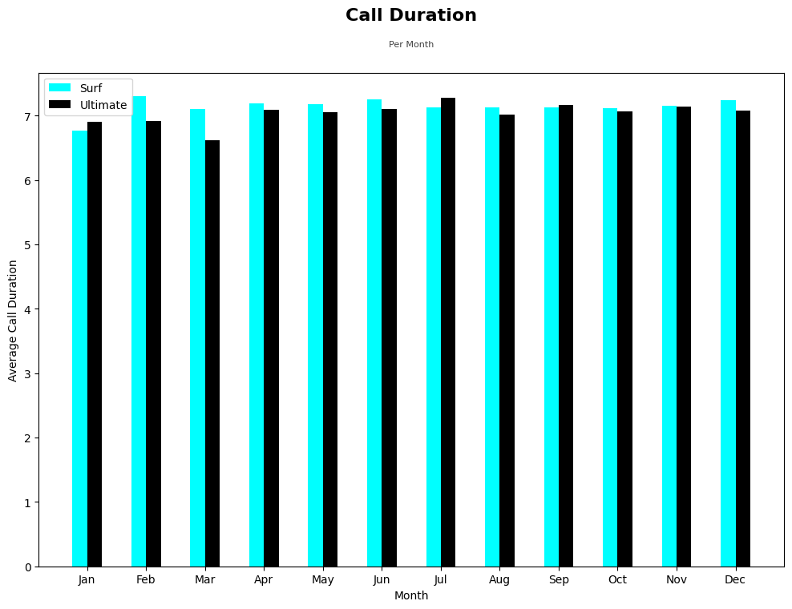
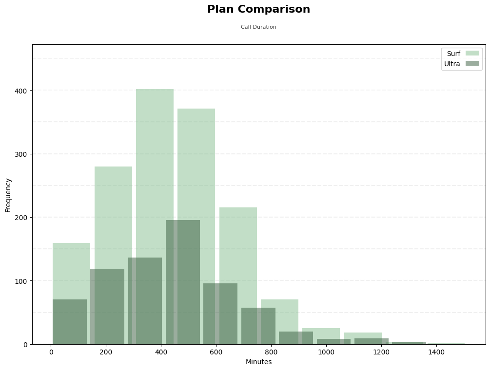
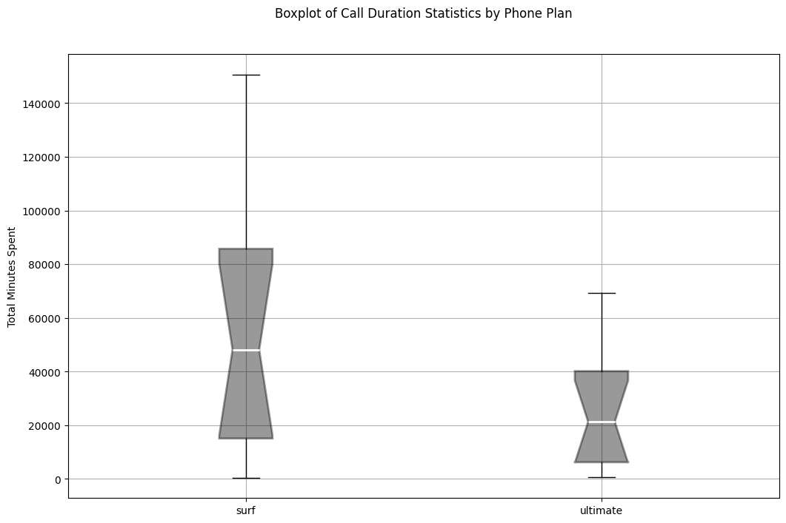
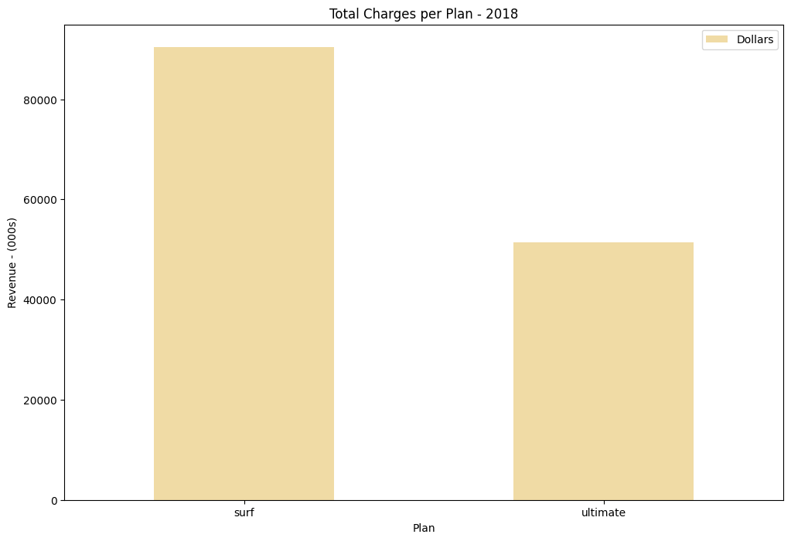

# TripleTen Sprint 3 - [Statistical Data Analysis](Statistical%20Data%20Analysis.ipynb)

### What we learned throughout the sprint:

- Learned to choose the optimal metrics for data description and how to define the necessary histogram type to assess continuous and discrete variables.
- Now understand how to draw conclusions on the data from statistical metrics and the basic notions of probability theory.
- Know how to define and calculate both normal and binomial distributions.
- Gained basic understanding of probability theory and know how to formulate and test hypotheses.

### Brief

The commercial department of a telecom operator wants to know which of their current plans bring in more revenue in order to adjust the advertising budget.

#### Task

Carry out a preliminary review of the plans based on a relatively small client selection, analyze clients' behavior and determine which prepaid plan brings in more revenue.  

- Test the following hypotheses:
  1) The average revenue from users of Ultimate and Surf calling plans differs.
  2) The average revenue from users in NY-NJ area is different from that of the users from other regions.

#### The Data

The data is spread across four files:

The `users` table (data on users):
- `user_id`: unique user identifier
- `first_name`: user's name
- `last_name`: user's last name
- `age`: user's age (years)
- `reg_date`: subscription date (dd, mm, yy)
- `churn_date`: the date the user stopped using the service (if the value is missing, the calling plan was being used when this database was extracted)
- `city`: user's city of residence
- `plan`: calling plan name
The `calls` table (data on calls):
- `id`: unique call identifier
- `call_date`: call date
- `duration`: call duration (in minutes)
- `user_id`: the identifier of the user making the call
The `messages` table (data on texts):
- `id`: unique text message identifier
- `message_date`: text message date
- `user_id`: the identifier of the user sending the text
The `internet` table (data on web sessions):
- `id`: unique session identifier
- `mb_used`: the volume of data spent during the session (in megabytes)
- `session_date`: web session date
- `user_id`: user identifier
The `plans` table (data on the plans):
- `plan_name`: calling plan name
- `usd_monthly_fee`: monthly charge in US dollars
- `minutes_included`: monthly minute allowance
- `messages_included`: monthly text allowance
- `mb_per_month_included`: data volume allowance (in megabytes)
- `usd_per_minute`: price per minute after exceeding the package limits (e.g., if the package includes 100 minutes, the 101st minute will be charged)
- `usd_per_message`: price per text after exceeding the package limits
- `usd_per_gb`: price per extra gigabyte of data after exceeding the package limits (1 GB = 1024 megabytes)

*The telecom operator rounds seconds up to minutes, and megabytes to gigabytes. For calls, each individual call is rounded up: even if the call lasted just one second, it will be counted as one minute. For web traffic, individual web sessions are not rounded up. Instead, the total for the month is rounded up. If someone uses 1025 megabytes this month, they will be charged for 2 gigabytes.*

#### The Process

This project was broken out a few steps:

1) Data preparation
    - data type conversion, finding and eliminating errors in the data
2) Data analysis
    - customer behavior review from the monthly requirements of minutes, texts and data volumes
    - mean, variance and standard deviation formulation
    - distribution examination 
3) Hypotheses testing
    - null and alternative hypotheses formulation
    - alpha threshold selection

#### Results

The general conclusion from this analysis is that the telecom operator's Surf plan brings in more revenue, especially true when it comes to data overages. The suggestion is to pursue a younger demographic of people in large metropolitan areas with heavier and modern advertising especially if the prospective users are of a busy lifestyle.

*Please refer to our full notebook for detailed summaries for each of our process steps as well as an in-depth, final conclusion.*

# Chart Examples

Included is the full Notebook which breaks out the description of our results.

# Plans for updates

None at the moment.
    
