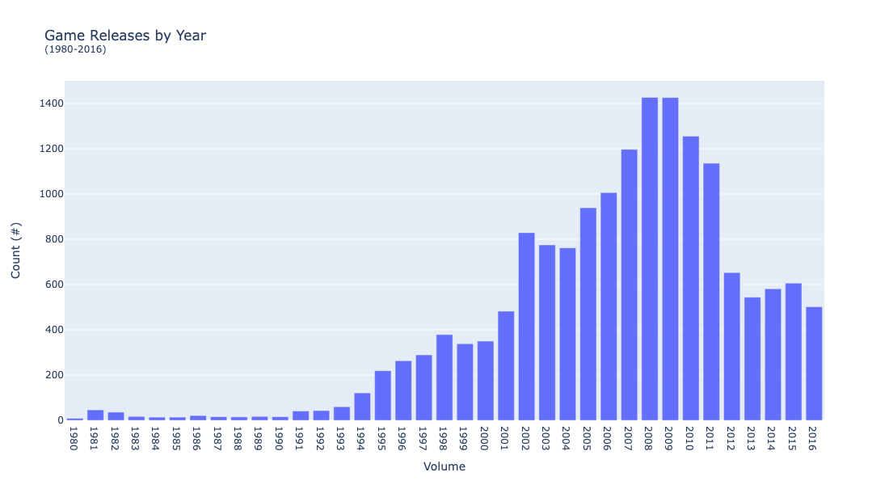

# TripleTen Sprint 5 - Integrated Project 1

### What we learned throughout the sprint:

- How to read data and prepare it for analysis.
- Use data to answer business questions and back up your conclusions with visualizations and tables.
- Perform hypothesis testing and prove whether a particular hypothesis is valid.
- Skills needed to summarize your work and come up with a set of valuable conclusions for a business’s needs.

### Brief

As an employee of a video game store you need to indentify patters that determine whether a game succeeds or not. Allowing you to spot potential big winners and plan advertising campaigns. 

#### Task

Find patterns in the open source data (*includes user/expert reviews, genres, platforms and historical game sales data*) in order to hone in on the optimal data horizon, the most profitable genres, regions and platforms. 

- Test two hypotheses:
  1) Average user ratings of the Xbox One and PC platforms are the same.
  2) Average user ratings for the Action and Sports genres are different.

#### The Data

The data is contained in one file:

— `Name`: video game name
— `Platform`: video game platform
— `Year_of_Release`: video game release year
— `Genre`: video game genre
— `NA_sales`: (North American sales in USD million) 
— `EU_sales`: (sales in Europe in USD million) 
— `JP_sales`: (sales in Japan in USD million) 
— `Other_sales`: (sales in other countries in USD million) 
— `Critic_Score`: (maximum of 100) 
— `User_Score`: (maximum of 10) 
— `Rating`: (ESRB)

*Data for 2016 may be incomplete.*

#### The Process

This project was broken out a few steps:

1) Data preparation
    - column name replacement, data type conversion, missing value identification, column creation
2) Data analysis
    - data horizon and platform examination based on video game sales
    - user and professional game review dissemination 
3) Region profile
    - top platform and market share drill downs
    - top genres and perceived difference comparison
    - ESRB rating impact on individual regions
4) Hypotheses testing
    - null and alternative hypotheses formulation
    - alpha threshold selection

#### Results

After navigating through the various steps for this project, our general conclusion is that the company should focus its campaign on the Xbox One and PS4 platforms. This is due to various factors in play like the popularity of video game genres, platforms, sales and overall regional variability as well as expected platform enhancements due to the console upgrading cycle (happening every ~5 years).

*Please refer to our full notebook for detailed summaries for each of our process steps as well as an in-depth, final conclusion.*

# Chart Examples

Included is the full Notebook which breaks out the description of our results.

# Plans for updates

1) Deploy functions to remove repetitive tasks, 2) Discover newer visualization patterns to tell the story and 3) Explore more ways of leveraging `.query()` while removing lines of code that can be one in one single thread.
    
