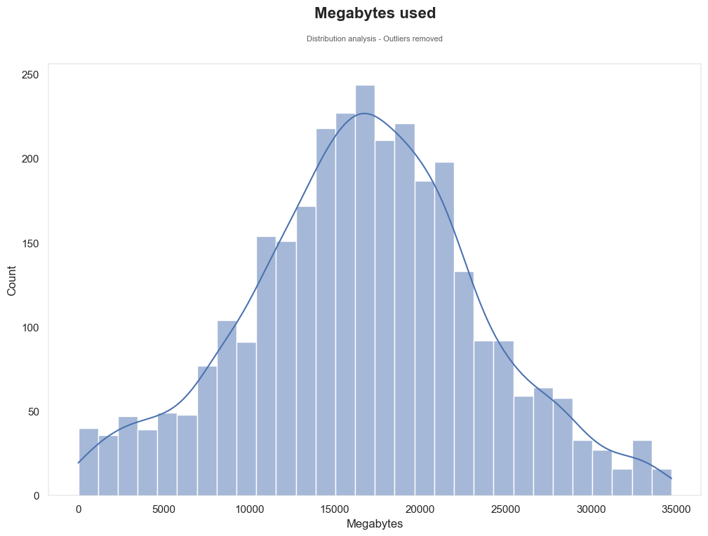
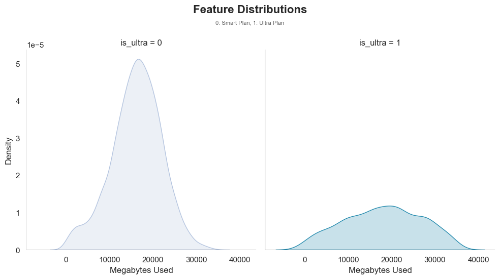
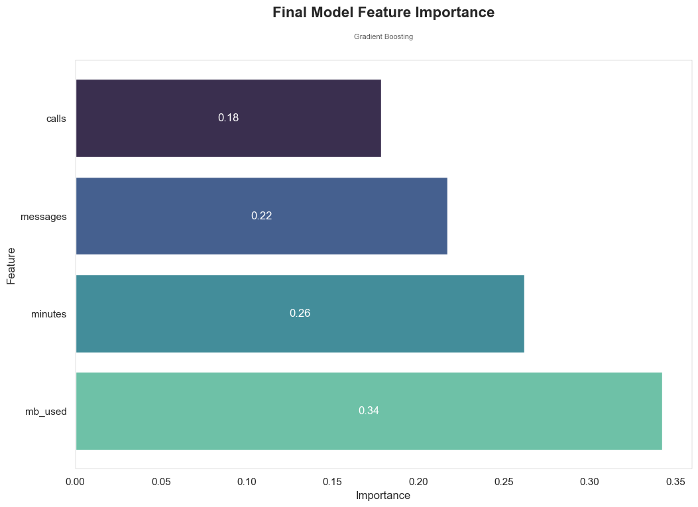

# TripleTen Sprint 7 - [Introduction to Machine Learning](Intro%20to%20ML%20v2.ipynb)

### What we learned throughout the sprint:

- To tell classification from regression; a model from a learning algorithm.
- To train a model and measure its quality using the sklearn library.
- To evaluate and test models.

### Brief

A mobile carrier has found many of their subscribers are still signed up for legacy plans. The company wants to develop a model to help them analyze behavior and recommend a newer plan.

#### Task

Leverage subscriber behavior data to develop a model with the highest possible accuracy score. The threshold is 0.75.

#### The Data

The data is housed in one file:

- `сalls`: number of calls
- `minutes`: total call duration in minutes
- `messages`: number of text messages
- `mb_used`: Internet traffic used in MB
- `is_ultra`: plan for the current month (Ultra - 1, Smart - 0), our target

#### The Process

As the data preprocessing step was previously completed (*see the project under the Statistical Data Analysis sprint*), we start with splitting the data into a training and test sets. 

Models are trained and examined for overall quality followed by the further toggling of hyperparameters to understand the impacts (on test set).

#### Results

Through iteratively searching for the best score/estimators, we achieve a final accuracy score of 82% when performing model evaluation using the test dataset.

# Chart Examples

Included is the full Notebook which breaks out the description of our results.

# Plans for updates

Nothing at the moment.