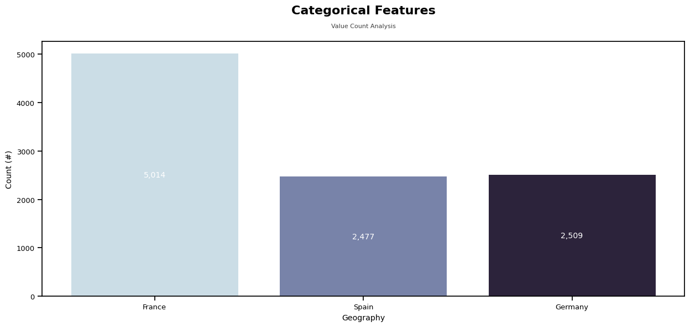
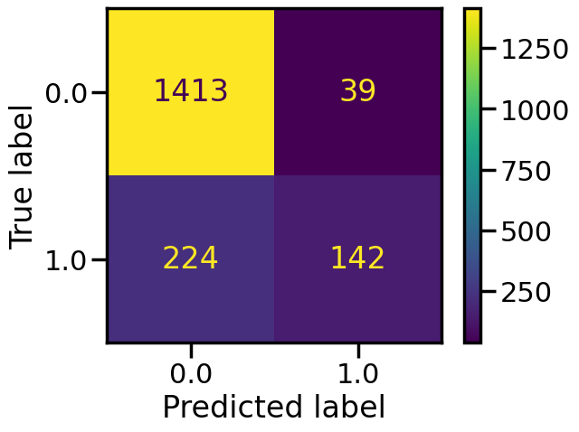
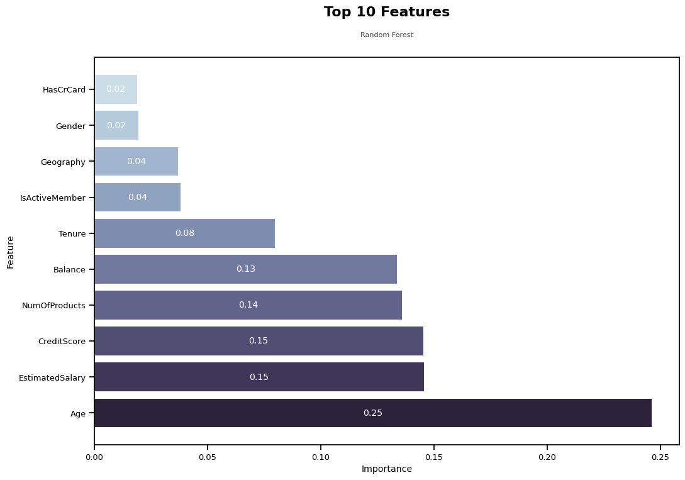
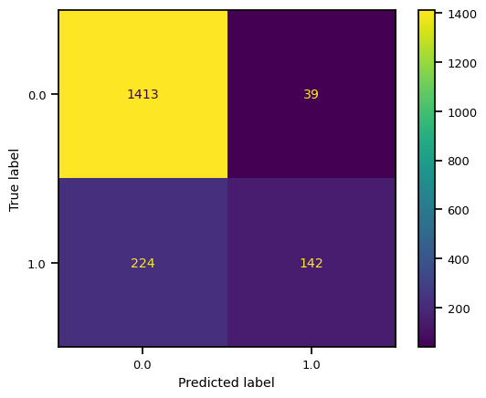

# TripleTen Sprint 8 - Supervised Learning

### What we learned throughout the sprint:

- How to work with new evaluation metrics such as precision, recall, F1 score and AUC-ROC.
- How to adjust class weights, downsample, upsample, and tune thresholds for classification tasks.
- To evaluate a model’s quality using R2 and MAE metrics in the regression tasks.

### Brief

A bank's customers are leaving little by little, chipping away every month. The bank would like to predict whether a customer will leave the bank soon as it figured out that it's cheaper to save the existing customers rather than attract new ones. 

#### Task

Utilize data on clients' past behavior and termination of contracts with the bank to build a model with the maximum possible *F1* score. Achieve a score of at least 0.59 and measure the *AUC-ROC* metric and compare it with the *F1*.

#### The Data

The data is housed in one file:

- `RowNumber`: data string index
- `CustomerId`: unique customer identifier
- `Surname`: surname
- `CreditScore`: credit score
- `Geography`: country of residence
- `Gender`: gender
- `Age`: age
- `Tenure`: period of maturation for a customer’s fixed deposit (years)
- `Balance`: account balance
- `NumOfProducts`: number of banking products used by the customer
- `HasCrCard`: customer has a credit card
- `IsActiveMember`: customer’s activeness
- `EstimatedSalary`: estimated salary
- `Exited`: сustomer has left, our target

#### The Process

Our first step is to prepare our data for training with the preprocessing of all feature types, investigating the balance of classes and taking into account any missing values.

We then plot AUC-ROC graphs, create confusion matrices and compute F1 metrics for various models. From these insights, we select the most optimal model (RandomForest Classifier) while diving further into class weight adjustments (via upsampling and downsampling techniques) and classification threshold comparisons that may help us achive the desired score.

#### Results

Through the usage of both class balance/weight adjustments and classification thresholds, we were able to achieve an F1 score above 0.59.

# Chart Examples

Included is the full Notebook which breaks out the description of our results.

# Plans for updates

None at the moment.