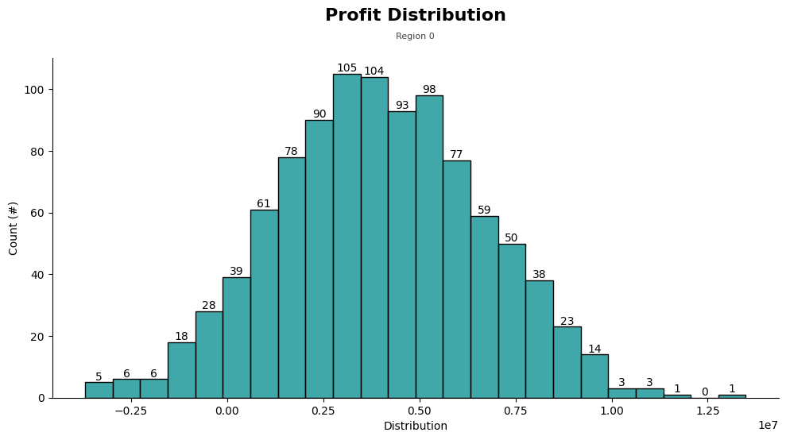
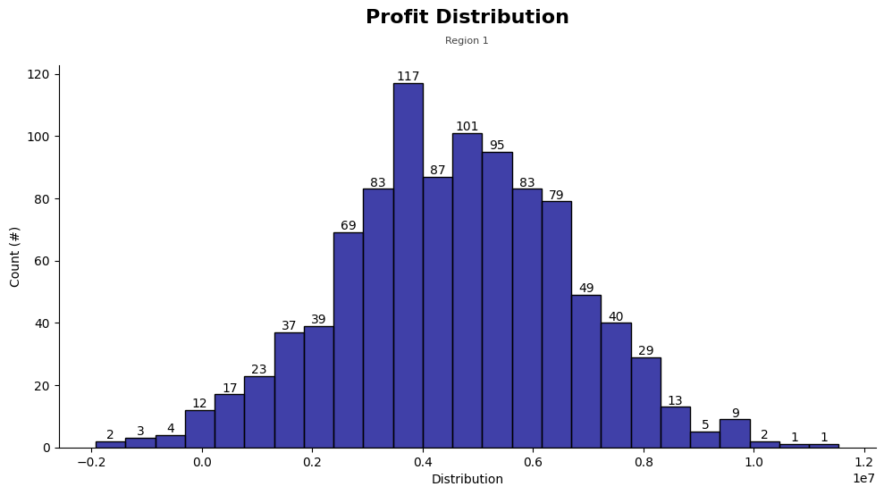
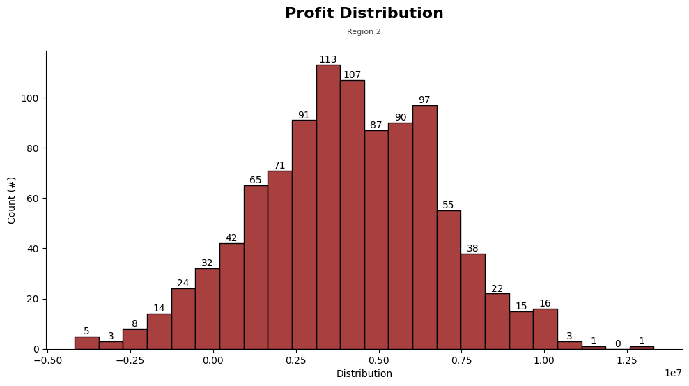

# TripleTen Sprint 9 - [Machine Learning in Business](TripleTen Projects/Sprint 9 - Machine Learning in Business/ML in Business v2.ipynb)

### What we learned throughout the sprint:

- Distinguish between offline metrics and online metrics.
- Use bootstrap to calculate confidence intervals and business metrics.
- Perform cross-validation so that conclusions about the model evaluation are more reliable.

### Brief

As a mining company employee your task is to find the best place for a new well.

Steps to choose the location:
1. Collect the oil well parameters in the selected region: oil quality and volume of reserves;
2. Build a model for predicting the volume of reserves in the new wells;
3. Pick the oil wells with the highest estimated values;
4. Pick the region with the highest total profit for the selected oil wells.

#### Task

Build a model that will help to pick the region with the highest profit margin. Analyze potential profit and risks using Bootstrapping techniques.

#### The Data

The data is spread across three files (three different regions):

- `id`: unique oil well identifier
- `f0, f1, f2`: three features of points (their specific meaning is unimportant, but the features themselves are significant)
- `product`: volume of reserves in the oil well (thousand barrels)

**Conditions**
1. Only linear regression is suitable for model training.
2. When exploring the region, a study of 500 points is carried with picking the best 200 points for the profit calculation.
3. The budget for development of 200 oil wells is 100 USD million.
4. One barrel of raw materials brings 4.5 USD of revenue The revenue from one unit of product is 4,500 dollars (volume of reserves is in thousand barrels).
5. After the risk evaluation, keep only the regions with the risk of losses lower than 2.5%. From the ones that fit the criteria, the region with the highest average profit should be selected.

*The data is synthetic: contract details and well characteristics are not disclosed.*

#### The Process

At first, we download and prepare the data explaining the steps we performed through preprocessing and exploratory data analysis. This follows model training and testing for each of the regions, finding the average volume of predicted reserves and the RMSE.

We then go into profit calculation, calculating the volume of reserves required for developing a new well without any losses. Providing findings for each region and the suggestion of which region the oil company should target.

#### Results

Using bootstrapping techniques, we found each region's the distribution of profit, average profit at the 95% confidence interval and risk of losses. 

Our initial findings first suggested the selection of Geography 2 and after further implementing bootstrapping techniques our initial thoughts were reinforced as that geography is predicted to bring in the highest average revenue out of the three.

# Chart Examples

Region 0 Profit Distribution

Region 1 Profit Distribution

Region 2 Profit Distribution

Included is the full Notebook which breaks out the description of our results.

# Plans for updates

None at the moment.